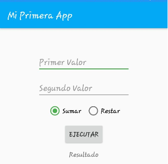
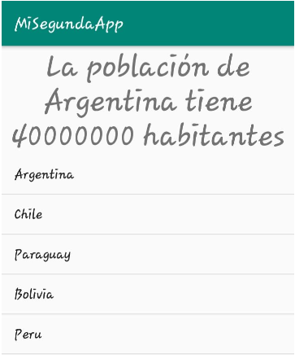
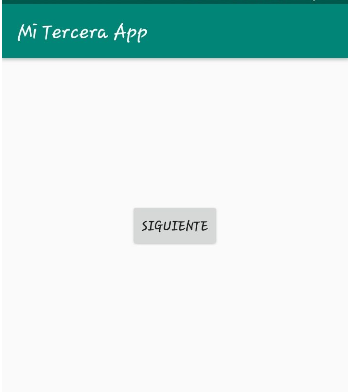
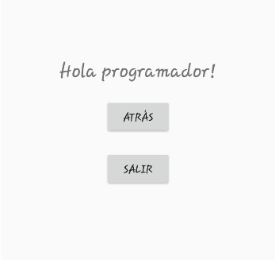

# Taller-COMPDES-2020

Taller básico de Android Studio con Kotlin para el Congreso de Computación para el Desarrollo (COMPDES). 
* Fecha: 29/07/2020.
* Horario: de 10:40am – 12:00md.

## Primera aplicación

## Segunda aplicación

## Tercera aplicación

### Autor 
Sebastián Rojas Vargas
* [LinkedIn](https://www.linkedin.com/in/sebastian-rojas-vargas/)
* [GitHub](https://github.com/SebastianRV26)
